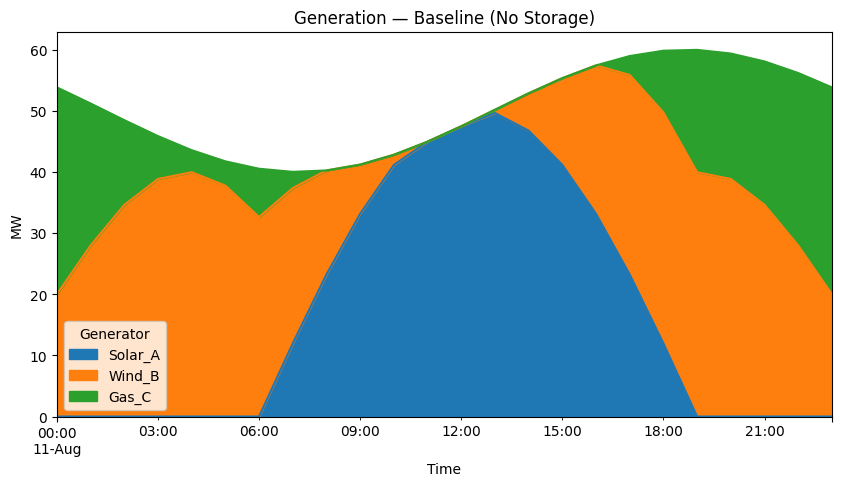
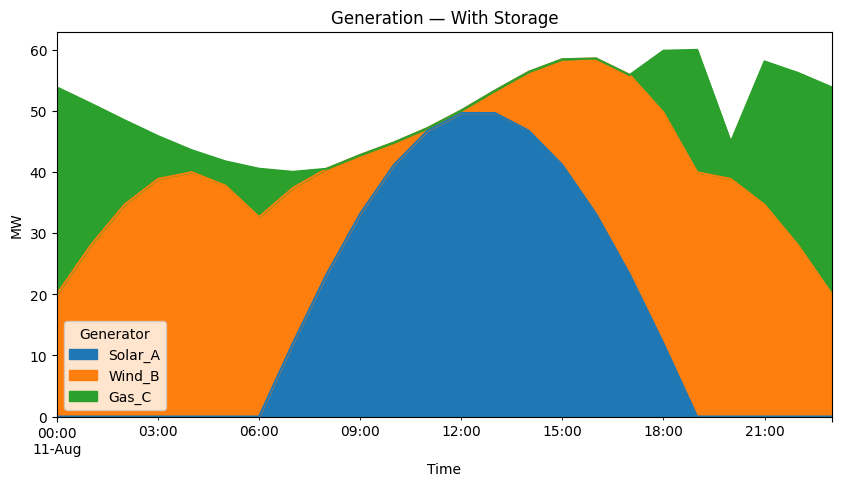
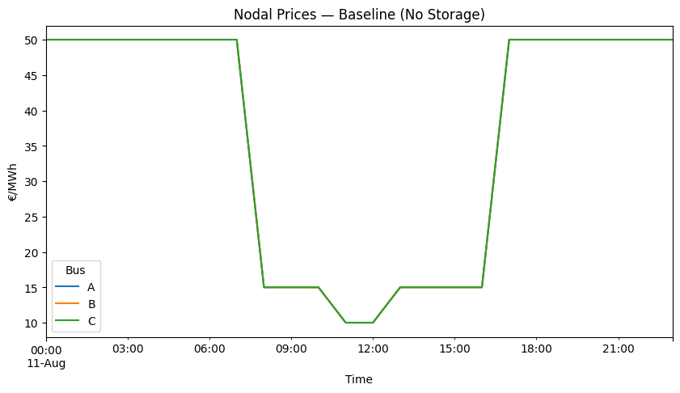
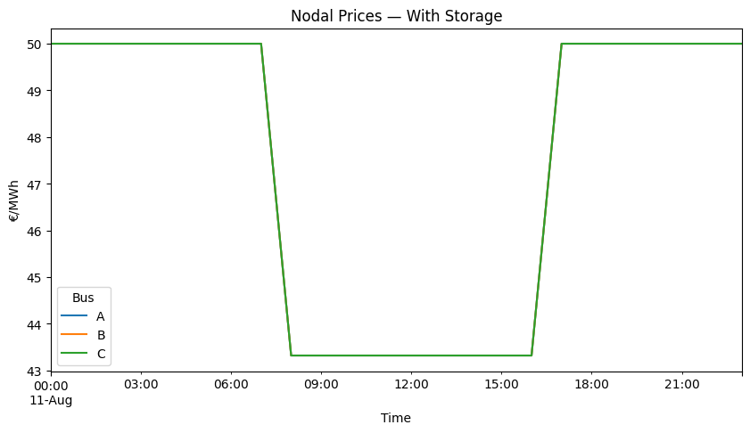

# Mini PyPSA Project — 3-Node Network

This **toy but realistic** PyPSA project demonstrates how storage affects dispatch, gas use, and nodal prices in a 3-node AC network.  
Simulates two runs — **Baseline** and **With Storage** 

## How to run
```bash
pip install pypsa pandas numpy matplotlib
```

Open and run pypsa_mini_project_clean.ipynb top-to-bottom.

## Results summary

| Metric                       | Baseline  | With Storage | Change   |
|------------------------------|-----------|--------------|----------|
| Objective cost (€)           | 24 252.65 | 23 681.35    | ↓ 2.35%  |
| Gas MWh                       | 235.27    | 217.69       | ↓ 7.5%   |
| Mean price (€/MWh)           | 36.46     | 47.50        | ↑ ~30%   |
| Price volatility (€/MWh, std) | 17.91     | 3.30         | ↓ 81%    |

## Visual results

**Generation — Baseline (No Storage)**


**Generation — With Storage**


**Nodal Prices — Baseline (No Storage)**


**Nodal Prices — With Storage**


## What this shows
- **Baseline:** Solar + Wind + Gas serve a 24-hour load .  
- **With Storage:** Adding a battery at the demand node reduces **total system cost** and **gas MWh** by shifting energy across time.  
- **Nodal prices** can rise in some hours with storage due to the **opportunity cost** of stored energy, even when total cost falls. That’s expected in markets with perfect arbitrage.


